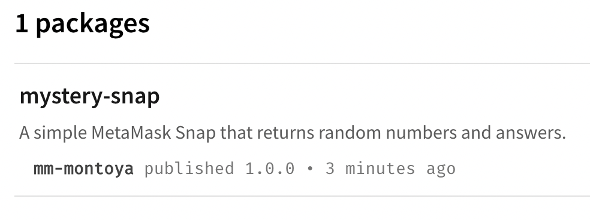

# Mystery Snap

This is a simple MetaMask Snap that returns random numbers and answers. Below are the steps for publishing a Snap to NPM for anyone to use.

## Prerequisite

Before you begin, you should familiarize yourself with the npm documentation for [Contributing packages to the registry](https://docs.npmjs.com/packages-and-modules/contributing-packages-to-the-registry).

You will also need an npm account. 

## Setup

`snap.manifest.json`: 

```JSON
{
  "version": "1.0.0",
  "proposedName": "Mystery Snap",
  "description": "A simple MetaMask Snap that returns random numbers and answers.",
  "repository": {
    "type": "git",
    "url": "https://github.com/Montoya/random-snap.git"
  },
  "source": {
    "shasum": "05E9ZMYL2tHWlHoTF9z4vnDqbxMFw3KfeEvHyfQeMRE=",
    "location": {
      "npm": {
        "filePath": "dist/bundle.js",
        "iconPath": "images/icon.svg",
        "packageName": "mystery-snap",
        "registry": "https://registry.npmjs.org/"
      }
    }
  },
  "initialPermissions": {
    "snap_confirm": {}
  },
  "manifestVersion": "0.1"
}
```

`source` contains what will be published to NPM for distributing the Snap. Proposed package name is `mystery-snap` (this is the only field that needs to be modified from `template-snap`). Also, the icon at `images/icon.svg` should be changed to something unique.

`package.json` (partial): 

```JSON
{
  "name": "mystery-snap",
  "version": "0.9.0",
  "description": "A simple MetaMask Snap that returns random numbers and answers.",
  "repository": {
    "type": "git",
    "url": "https://github.com/Montoya/random-snap.git"
  },
```

## Publishing

Once your Snap is ready for release, use the following command to publish: 

`yarn publish`

The CLI will walk you through bumping the version of your Snap and logging into your npm account to publish it, like so: 

```Bash
yarn publish v1.22.18
[1/4] Bumping version...
info Current version: 0.9.0
question New version: 1.0.0
info New version: 1.0.0
[2/4] Logging in...
question npm username: [YOUR USERNAME]]
question npm email: [YOUR EMAIL]
question npm password: [YOUR PASSWORD]
info Two factor authentication enabled.
question npm one-time password: [YOUR OTP]
success Logged in.
[3/4] Publishing...
success Published.
[4/4] Revoking token...
success Revoked login token.
✨  Done in 83.33s.
```

If successful, you can visit your npm account dashboard and see your newly published Snap package.



Then, any dApp can use the published Snap ID to connect to this Snap: 

```JavaScript
const snapId = `npm:mystery-snap`;
```

## Acknowledgements

Crystal Ball icon by [OpenMoji](https://openmoji.org/).